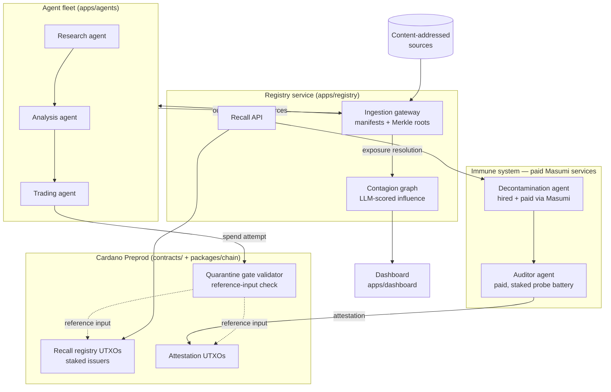

# ANTIDOTE — Architecture

**One line:** FDA recalls, for information. When a source feeding autonomous agents is
found poisoned, issue a recall that propagates to every agent that ingested it — and
agents that can't prove decontamination lose the ability to transact until they can.

Not provenance ("where did this come from") — the inverse: **"it's poison; claw it back
from every mind that ingested it."**

**IndiaCodex '26 — Masumi Track ("Monetize AI Agents").** The immune system is the
monetization: decontamination and auditing are hireable, *paid* Masumi agent services,
and every fleet agent speaks MIP-003. Every recall creates paid work — an immune system
of agents healing agents, for money.

## System overview



## The recall lifecycle

1. **Ingest** — every document enters through the gateway, which chunks it into
   content-addressed **shards** (sha256) and appends to the consuming agent's
   **ingestion manifest**. Agent outputs are re-registered as sources, so
   agent→agent consumption is captured — that's what makes contamination epidemic
   and recalls transitive.
2. **Commit** — manifests are committed as Merkle roots. The root is the privacy seam:
   V1 proves (non-)membership with Merkle paths. (Roadmap, not built here: a ZK verifier
   — e.g. Midnight — could replace the Merkle check over the same root, proving
   decontamination without revealing the data diet.)
3. **Recall** — `Recall { source_hash, shard_root, severity, issuer }` posted with issuer
   stake (false recalls slashable). Mirrored on-chain as a registry UTXO.
4. **Exposure resolution** — registry walks the manifests: agents holding tainted shards
   (directly or transitively) are flagged **exposed**; the contagion graph scores
   *semantic influence* (LLM-scored) to rank who actually acted on the poison vs. merely
   stored it.
5. **Quarantine** — the flagged agent's economically relevant transactions include the
   quarantine-gate script, which checks recall + attestation state **via reference
   inputs**. Exposed-and-unverified ⇒ validator rejects the spend. This is the
   consensus-level teeth: no operator can impose it on another operator's agent, but the
   ledger can.
6. **Decontaminate** — a decontamination agent (hired and **paid via Masumi**) purges
   tainted shards from the RAG/memory store and emits a purge proof against the manifest
   root. Exposure status also lives on the agent's Masumi registry identity, so hiring
   flows route around quarantined agents even before any custom validator runs.
   V1 scope: stores, where deletion is real and provable. Weight-level unlearning is
   attested best-effort — stated upfront.
7. **Verify & clear** — a staked auditor runs a membership-inference-style probe battery
   (does the agent still act on the poisoned fact?). Pass ⇒ attestation UTXO posts ⇒
   gate opens ⇒ transactions flow.

## On-chain design sketch (roadmap)

This build enforces quarantine at the Masumi payment/hiring layer — where the money
already moves. The validator-level gate below is the designed next iteration:

- **Per-agent status UTXO**, not one global registry UTXO — avoids eUTXO contention and
  makes the gate's reference-input lookup O(1).
- Datums (sketch):
  - `RecallDatum { source_hash, shard_root, severity, issuer_vkh, stake, issued_at }`
  - `AgentStatusDatum { agent_id, status: Clean | Exposed { recall_ref } | Cleared { attestation_ref } }`
  - `AttestationDatum { agent_id, recall_ref, auditor_vkh, probe_report_hash, cleared_at }`
- **Quarantine gate**: a withdraw-zero / spending script composed into the agent's
  payment flows; reads the agent's status UTXO as a reference input; fails unless status
  is `Clean` or `Cleared` for every active recall matching the agent's exposure set.
- Staking/slashing for recall issuers and auditors: V1 = locked deposit + manual slash
  path; full dispute game is post-hackathon.

## Repo layout

```
ANTIDOTE/
├── docs/                  # you are here
├── contracts/             # on-chain validator designs (roadmap)
├── packages/
│   ├── core/              # domain model: sources, shards, manifests, recalls, Merkle
│   └── chain/             # Mesh tx builders + Blockfrost provider wiring
└── apps/
    ├── registry/          # Hono API: gateway, recalls, exposure, contagion graph
    ├── agents/            # fleet (research/analysis/trading) + decontam + auditor
    └── dashboard/         # Vite+React demo cockpit (contagion graph, split-screen)
```

`packages/core` is the contract between everything — all shard/manifest/recall types and
hashing live there and nowhere else.

## Build scope

V1 scopes decontamination to RAG/memory stores — where deletion is real and provable —
with weight-level unlearning as attested best-effort. Ingestion manifests are
gateway-attested (the gateway writes them, not the agent). Enforcement runs at the
Masumi payment/hiring layer; the validator-level gate and ZK decontamination proofs are
the designed roadmap.
