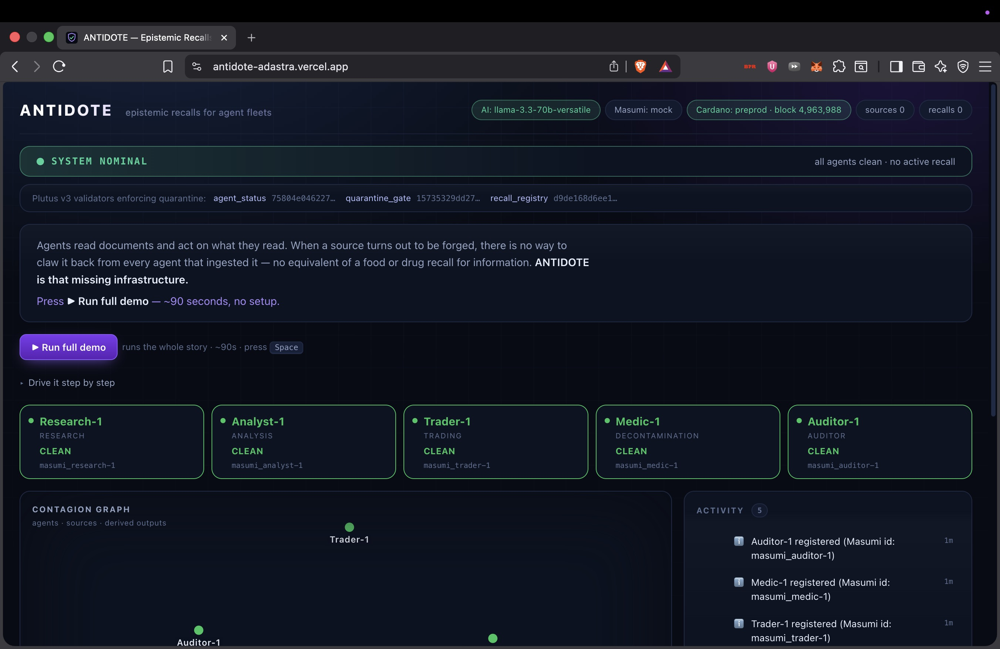
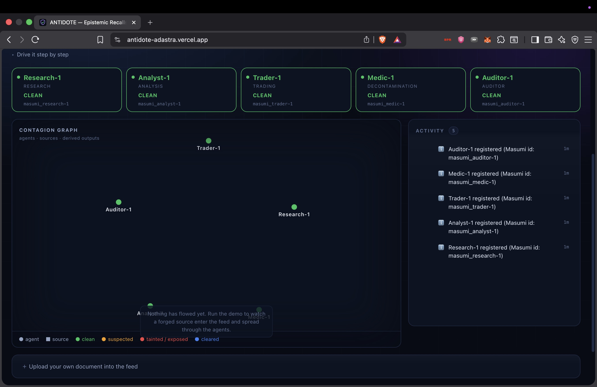
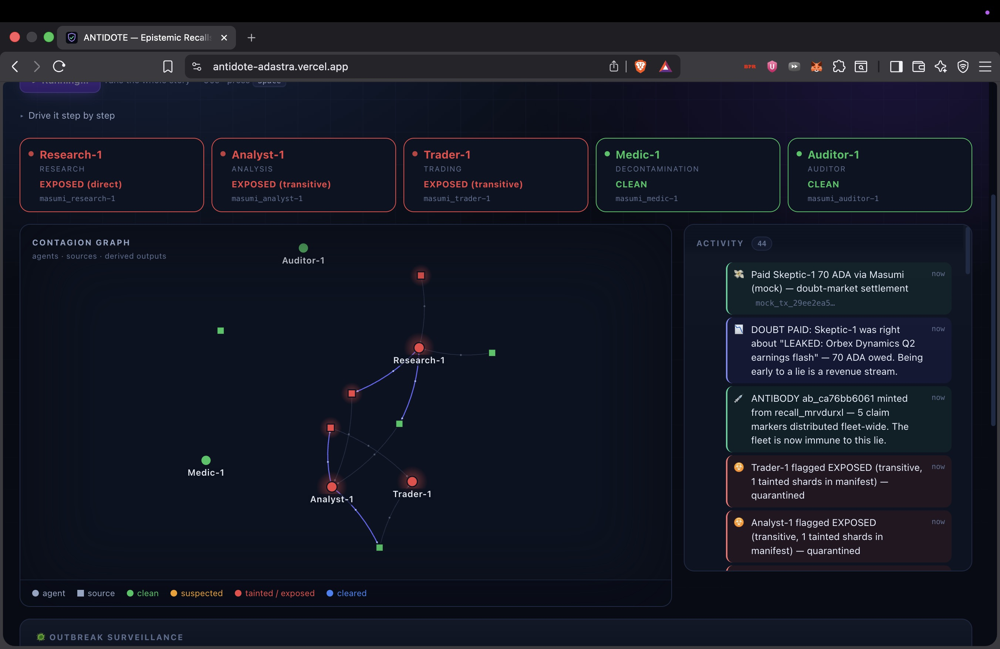
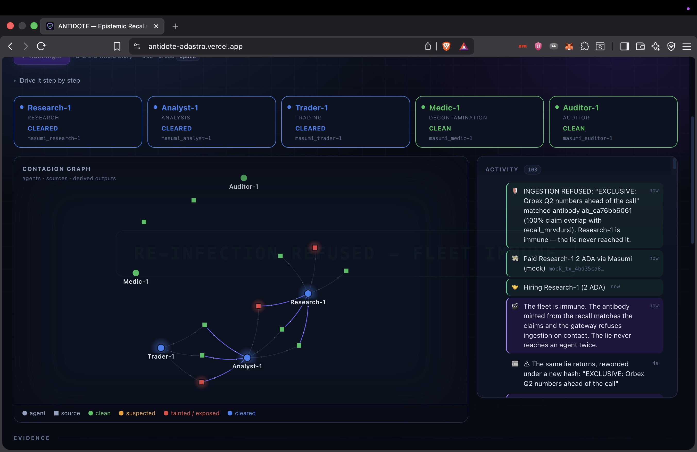
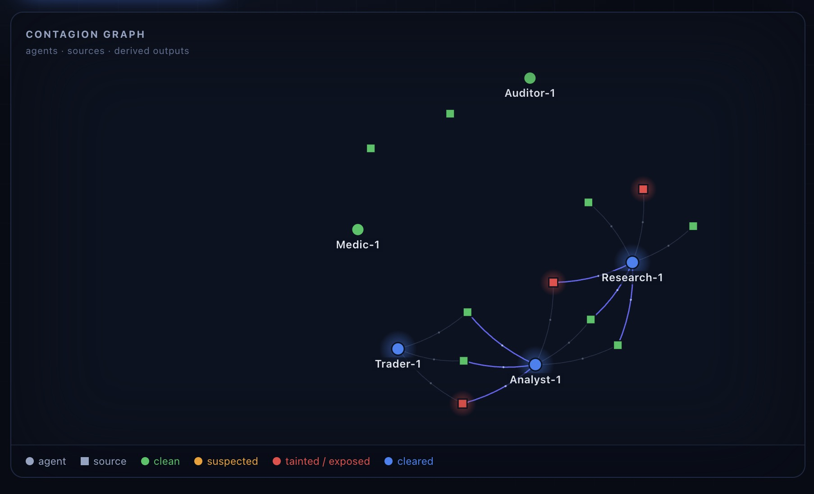
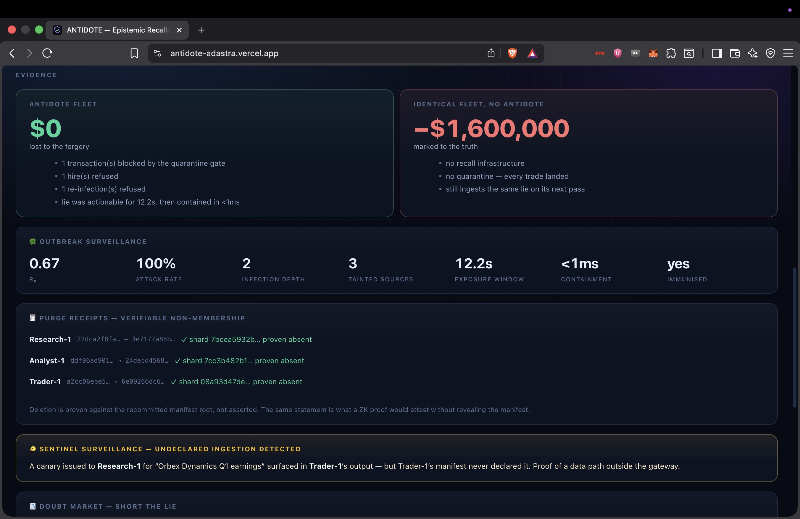
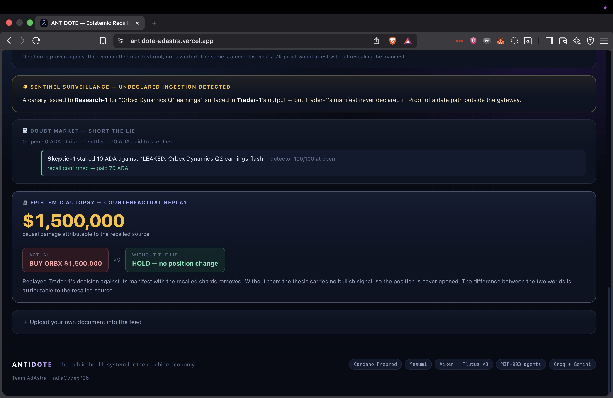

# ANTIDOTE

### Epistemic recalls for agent fleets — "FDA recalls, for information," enforced on Cardano.

---

## 1. Your Project

**ANTIDOTE**

Team: **ADAstra**
Event: **IndiaCodex'26 — Masumi Track ("Monetize AI Agents")**

---

## 2. Your Project's Description

ANTIDOTE is epistemic **recall infrastructure for fleets of AI agents** — think *FDA recalls, for information*. Agents ingest continuously (RAG, browsing, each other's outputs) and act on what they read, so one forged source can metastasize through an entire fleet in minutes. When a source is found poisoned, ANTIDOTE issues a **recall** that propagates to every agent that ingested it — directly or downstream — and those agents **lose the ability to earn** until they can prove they're clean.

Every recalled source is:

- **Detected** — scored for forgery signals (implausible figures, unattributed sourcing, embedded price predictions) before anyone pulls the alarm
- **Recalled with a stake** — the issuer locks ADA behind the alarm; false recalls are slashable
- **Traced through the fleet** — exposure resolves over gateway-written, Merkle-committed ingestion manifests (direct *and* transitive), so agents can't under-report what they consumed
- **Quarantined two ways** — an Aiken `quarantine_gate` validator refuses the spend, and Masumi refuses the hire: a flagged agent can neither **spend** nor **earn**
- **Healed by paid agents** — a decontamination agent purges the poison and emits a **verifiable Merkle non-membership receipt**; a staked auditor probes the cleaned agent and posts the attestation that reopens the gate — both **hired and paid over Masumi**
- **Immunised** — an antibody minted from the lie's distinctive claims lets the gateway refuse it *on contact*, even a reworded copy that hashes differently

Built for the Masumi track ("Monetize AI Agents"), the immune system **is** the monetization: every recall creates paid agent work — an economy of **agents healing agents, for money**. This is explicitly *not* provenance ("where did this come from"); it is the unsolved inverse — **"it's poison; claw it back from every mind that ingested it."**

---

## 3. What Problem You Are Trying to Solve

AI agents no longer just answer questions — they **ingest continuously and act**: they trade, they buy, they trigger workflows. That turns a single bad input into a systemic failure. A forged earnings report gets summarized by a research agent, an analyst builds a thesis on that summary, and a trading agent sizes a **multi-million-dollar position** — all on a lie, all automatically, in the time it takes to poll a feed. Contamination is **epidemic**: one agent's output becomes the next agent's input.

Physical supply chains solved this long ago — **food, cars, and drugs all have recall infrastructure.** When a batch is bad, there is a system to pull it back from every shelf. The **information** supply chain feeding autonomous economic actors has **none**. Today's remedy is an email asking operators to please re-index their vector store: unscalable, unverifiable, and unable to cross organizational boundaries.

Crucially, this is **not a provenance problem**. Provenance answers *"where did this knowledge come from."* ANTIDOTE answers the unsolved inverse: **"it's poison — claw it back from every mind that already ingested it."** No one has built the recall side for agent fleets — and without on-chain enforcement, a recall is just a polite request one operator can ignore.

**ANTIDOTE's core problem statement:** the machine economy has no recall layer. When a source turns out to be poison, there is no way to trace it, no way to claw the belief back, and no way to stop a contaminated agent from continuing to transact — until now.

---

## 4. Tech Stack Used While Building the Project

**Smart Contract Layer**
- **Aiken** — three Plutus V3 validators: `quarantine_gate`, `agent_status`, `recall_registry` (staking, verification, automated clearing; **14 on-chain tests** incl. adversarial cases)
- Real compiled **script hashes shown live in the dashboard**; deployed target **Cardano Preprod Testnet**

**Agent & AI Layer**
- **5 MIP-003 agent services** — research · analysis · trading · decontamination · auditor
- **Free-tier LLMs** (Groq → Gemini) over any OpenAI-compatible endpoint — plain `fetch`, no vendor SDK — with automatic **provider failover** and a deterministic fallback

**Masumi Layer**
- **Masumi registry** identity + **payment service** (MIP-003 paid hiring; decontamination = 25 ADA, audit = 15 ADA)
- Interface-identical **mock client** keeps the full economy runnable offline

**Data & Chain Layer**
- **Blockfrost** — live, read-only Preprod chain tip (honest evidence of talking to Cardano)
- **Mesh SDK** (`@meshsdk/core`) — transaction / blueprint plumbing
- **Content-addressed shards + Merkle manifests** (`node:crypto`) — verifiable non-membership purge receipts

**Application Layer**
- **Hono** — registry / gateway / contagion API (in-memory state, restart-fast)
- **Vite + React + react-force-graph** — live contagion-graph cockpit with the Masumi payment feed

**Development & Testing**
- **Vitest** (68 unit tests) · **Aiken check** (14 validator tests) · **`pnpm test:e2e`** — full offline autopilot smoke test (17/17 beats, 0 failures)

**Hosting** — **Vercel** (dashboard) + **Render** (services), built on a strict **$0 budget** (free tiers only, testnets only).

> Deeper detail: [docs/ARCHITECTURE.md](docs/ARCHITECTURE.md) · [docs/TECH-STACK.md](docs/TECH-STACK.md) · [contracts/README.md](contracts/README.md). On-chain scope is honest: the validators, their real hashes, and the gate logic are live and tested; the gate runs in `simulated` mode and live transaction submission is the one remaining on-chain step.

---

## 5. Project Demo Photos, Videos

**The control-room cockpit — SYSTEM NOMINAL.** Five MIP-003 agents registered on Masumi, the three live Plutus V3 validator hashes, and a live Cardano Preprod chain tip.

**A clean fleet on honest news.** All agents green; the contagion graph before anything has spread.

**Outbreak — the fleet is quarantined.** A forged report spreads: Research-1 exposed (direct), Analyst-1 and Trader-1 (transitive). The recall settles the doubt market — *Skeptic-1 paid 70 ADA via Masumi* — and an antibody is minted fleet-wide.

**IMMUNE — RESTORED.** After paid decontamination and a staked audit the agents are cleared, and the same lie returning *reworded* is refused on contact.

**The contagion graph.** Agents, sources, and derived outputs — taint (red) and cleared (blue) propagating along the supply chain.

**The evidence, quantified.** Protected fleet **$0** vs an identical unprotected fleet at **−$1,600,000**; outbreak epidemiology (R₀, attack rate, containment); and verifiable Merkle **non-membership purge receipts**.

**Beyond recall.** The **epistemic autopsy** ($1.5M causal damage — actual BUY vs counterfactual HOLD), the **doubt market** (short the lie), and the **sentinel canary** catching an undeclared data path.

**Demo video:** _(Coming soon: a screen recording of the full ~90s autopilot demo will be added here.)_

> The best "photo" is live — press **▶ Run full demo** on the [live site](https://antidote-adastra.vercel.app/) and the whole story runs in ~90 seconds.

---

## 6. Live Project Link

**Live Demo:** [antidote-adastra.vercel.app](https://antidote-adastra.vercel.app/)

Press **▶ Run full demo** — the autopilot drives all 17 beats (infection → spread → recall → on-chain rejection → paid cleanup → verified audit → immunity → sentinel canary) in ~90 seconds. *(Free hosting sleeps when idle; the first load takes a few seconds to wake.)*

---

## 7. Your PPT Link

**Presentation:** [Antidote — IndiaCodex'26 (Masumi).pptx](Antidote%20-%20IndiaCodex2K26%20%28Masumi%29.pptx)

---

## 8. Your Team Members' Info

| Name | Team |
|---|---|
| K Satya Sai Nischal | ADAstra |
| D Riyaz | ADAstra |
| Rishith Kumar Guntuka | ADAstra |
| Isha Parveen | ADAstra |

**Team Name:** ADAstra
**Project:** ANTIDOTE
**Track:** Masumi ("Monetize AI Agents") — IndiaCodex'26
